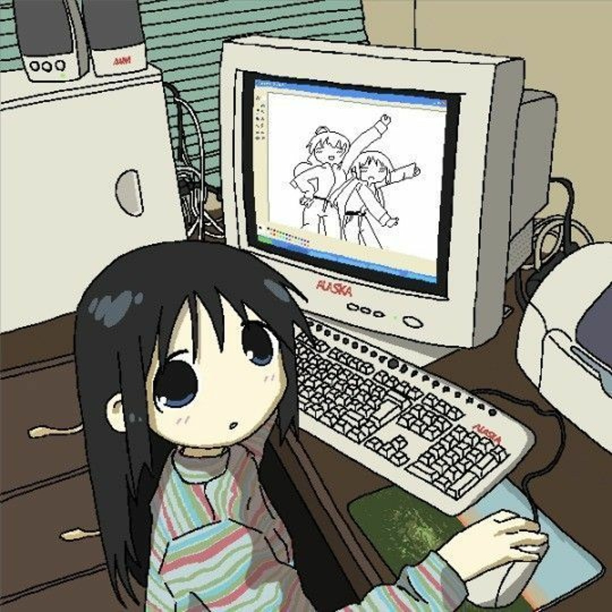

## 🎉Hi! Nice to meet you!

### I'm an ordinary college student who loves getting involved in all kinds of open-source projects.

  

## 🎨ME
- Love coding
- Member of **[@NCUHOME](https://github.com/NCUHOME)**
- Member of **[@NCUSCC](https://github.com/NCUSCC)**
- Member of **[@hust-open-atom-club](https://github.com/hust-open-atom-club)**

## 📈 GitHub Activity Graph:

<table>
  <tr>
    <th>
      
    </th>
    <th>
       
    </th>
  </tr>
</table>

  

## 🧑‍🤝‍🧑 Visitors

<!--
**CAICAIIs/CAICAIIs** is a ✨ _special_ ✨ repository because its `README.md` (this file) appears on your GitHub profile.

Here are some ideas to get you started:

- 🔭 I’m currently working on ...
- 🌱 I’m currently learning ...
- 👯 I’m looking to collaborate on ...
- 🤔 I’m looking for help with ...
- 💬 Ask me about ...
- 📫 How to reach me: ...
- 😄 Pronouns: ...
- ⚡ Fun fact: ...
-->
